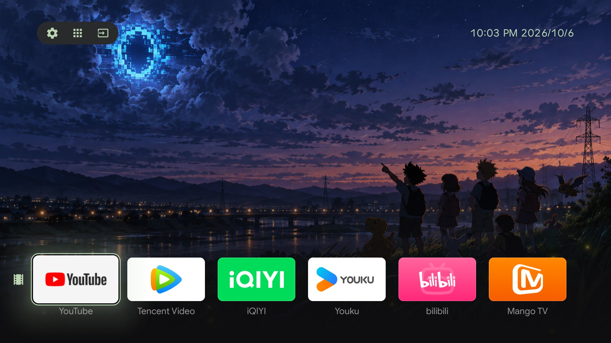

# UnitedU

**English** | [简体中文](README.zh-CN.md)

[](https://github.com/GordonWang1878/UnitedU-launcher/releases/latest)  [](LICENSE)

**An ad-free Android TV / Google TV launcher.** No ads, no recommendations — just the apps you put there.



UnitedU is an open-source home screen (launcher) for Android TV, Android 9 and later. It looks like Google TV, but the only content on it is the apps you choose. It is built for two kinds of TVs:

- **Google TV / Android TV with Google services**, if you find the stock home screen too full of recommendations and ads and want a clean one — similar in spirit to Projectivy Launcher. On these TVs the HOME button goes to the Google home screen by default; turn on [Home Button Takeover](#home-button-takeover) to send it to UnitedU.
- **Chinese-market TVs without Google services**, whose maker lets you change the home app. These factory home screens are usually heavy and ad-filled. UnitedU has only been tested on a real Chinese-market Sony A95L; see [Compatibility](#compatibility) for other brands.

UnitedU never goes online, except at the moment you press "Check for Updates" (and while the "Upload Files" page is open, when the TV runs a temporary upload server on your local network). It is not on Google Play or any other app store; download the APK from [GitHub Releases](https://github.com/GordonWang1878/UnitedU-launcher/releases) and install it yourself.

Package name `com.uniteduone.launcher`, minimum Android 9 (API 28). **Latest version: 1.0.2 (2026-10-03)**, GitHub Release `v1.0.2` (versionCode 5), also mirrored at `dl.uniteduone.com` (Cloudflare R2) so TVs in mainland China can update without a proxy. License at the end.

The app's interface is available in English, Simplified Chinese and Traditional Chinese. The development records under `docs/` (design specs, work log, research) are in Chinese.

## Features

- **Home screen**: wallpaper plus rows of app cards (1–5 rows; each row has an icon you can change, and no name). Three buttons at the top left — Settings / Apps / Inputs — and a clock at the top right. Three card sizes; a row shows exactly **5 / 6 / 8 cards** (large / medium / small). Card titles can be turned on or off. Newly installed apps don't appear on their own; you add them. With no apps on the home screen, a hint at the bottom has a "Go Now" button that opens Edit Home Screen.
- **All Apps** (the "Apps" button): every launchable app on the TV, including those already on your home screen. OK opens one; hold OK or press Menu for Open / Uninstall (when possible) / Add to Home….
- **Inputs** (the "Inputs" button): switch between HDMI and TV sources, rename or hide them. An HDMI-CEC device and the port it's on are shown once; multiple tuners are merged into one "TV".
- **Settings**: a column of buttons on the right, one level at a time, at most 6 per page. Card and wallpaper settings show a live preview on the left.
- **Built-in images**: 4 wallpapers, 4 screensaver photos and 7 app card images (Tencent Video, iQIYI, Youku, bilibili, MIGU, Mango TV, YouTube — each only usable for its own app). All three image pickers are split into "Built-in" and "Mine". The built-in wallpapers and screensaver photos are HDR photos with gain maps (Ultra HDR, in both the Android 14 and the Android 15+ formats): brighter highlights on TVs whose interface supports HDR, ordinary photos everywhere else.
- **Screensaver**: photos with a slow pan-and-zoom and crossfades, or short videos (muted; only the first 60 seconds of longer ones). UnitedU can also be picked as the TV system's screensaver, showing the same gallery and continuing from the same item.
- **Upload Files**: scan a QR code with your phone and upload wallpapers, card art, screensaver photos and videos, or install APKs from the phone's browser — no USB stick, no computer.
- **Three interface languages**: English / 简体中文 / 繁體中文, or follow the system.
- **Home Button Takeover**: on TVs where you can't change the default home app (Google TV, newer Xiaomi firmware, …), turn on one switch under the system's Accessibility settings and HOME goes straight to UnitedU, without uninstalling the stock home screen (see [Set as the default home screen](#set-as-the-default-home-screen); not yet tested on a real TV).

## Compatibility

**Whether UnitedU works mostly depends on what the TV maker allows: installing third-party APKs, and handing the HOME button to a third-party home screen. The only Android-version limit is that it won't install below Android 9.** The table below is the result of research in October 2026; except for the Sony A95L, nothing has been tested on a real TV. Full reasoning and sources (in Chinese): [`docs/research/2026-10-02-tv-compatibility.md`](docs/research/2026-10-02-tv-compatibility.md).

| Status | Brand / system | Notes |
|---|---|---|
| ✅ Works as the home screen (tested) | Sony A95L, Chinese market (Android 14) | All features |
| ✅ Works as the home screen (untested) | Sony Chinese-market models from 2019 on, Android 9+ | Same system as the A95L |
| ⚠️ Works, with conditions | Google TV / Android TV with Google services (worldwide) | Installs and runs, but HOME goes to the Google home screen by default (the stock launcher has higher priority). To make HOME open UnitedU, turn on Home Button Takeover (see below; tested on emulators, not yet on a real TV), or disable the Google home screen with adb at your own risk |
| | Hisense / Vidda (Chinese-market Android models) | Pressing HOME shows a chooser; pick UnitedU. After a power cut it returns to the stock Juhaokan home screen |
| | Konka | No default-home setting; the Konka home screen must be frozen with adb |
| | Xiaomi / Redmi firmware before about 2020 | HOME can be given to a third-party home screen |
| | Honor Vision, LeTV | Possibly; untested |
| ℹ️ Only as a regular app | Xiaomi / Redmi firmware from 2021, HyperOS | HOME is forced to PatchWall |
| | Skyworth / Coocaa | The default home screen is hard-wired into the system |
| | Huawei Vision (HarmonyOS 1–4) | Installs, but the default home screen can't be changed |
| ❌ Won't install / not applicable | TCL / FFALCON | The system blocks launcher-type APKs |
| | Most Changhong models | The system blocks third-party APK installs |
| | Huawei MateTV (HarmonyOS 5 and later) | No longer runs Android apps |
| | Samsung, LG | Not Android |
| | TVs on Android 8.1 or earlier | Android 9 is the minimum |
| ❓ Not enough information | Sharp, Philips (China), Haier / Leader | Sideloading works; the rest needs a real TV |

Some features also depend on how the maker implemented things:

- **Inputs** uses Android's standard TV input framework. Most Chinese TVs switch HDMI through their own private interfaces, so on those TVs this page will probably be empty (only "Back").
- **System screensaver**: whether UnitedU can be picked in the TV's screensaver setting is up to the maker; Google TV only offers "Ambient mode" and doesn't list third-party screensavers. UnitedU's own idle screen and screensaver work regardless.
- **Returning to the home screen automatically after an update** requires "Display over other apps" for UnitedU in the TV settings (the About page walks you there when you check for updates); not needed on Android 9.
- **Home Button Takeover** (Settings → General → Set Default Home App; see below) uses an accessibility service to take the HOME button back. Where it can intercept the key, it does so directly (no flash); where the TV's key policy doesn't give HOME to accessibility services, it falls back to "pull UnitedU back as soon as the stock home screen appears" (with a brief flash). On TVs in the "only as a regular app" group (Xiaomi 2021+ firmware, Skyworth / Coocaa), turning it on may make HOME return to UnitedU — **untested**. Fire OS is not supported.

## Install

UnitedU isn't in any app store, so you put the APK on the TV yourself. Two ways:

1. **Computer + adb**: on the TV, turn on "Developer options → USB debugging" (or "Wireless debugging"), then on the computer run

   ```bash
   adb install -r unitedu-<version>.apk
   ```

   `-r` replaces an existing install of the same package and is harmless on a first install. Installing with adb bypasses the "unknown sources" check, so nothing pops up on the TV.

2. **From your phone, no computer**: if UnitedU is already running on the TV (even an older version someone installed for you), open Settings → General → Upload Files, connect your phone to the TV's Wi-Fi, scan the QR code (or type the address shown on screen) in the phone's browser, switch to the "Apps" tab and upload the file (100 MB max). The TV shows the system installer. (When the APK is a newer UnitedU itself, it goes through the same session install as About → Check for Updates and doesn't turn off Home Button Takeover; see [Check for updates](#check-for-updates).) This route is for installing other apps or updating later; **the first UnitedU still needs adb**.

"Install unknown apps" only matters for the second route (and for updates from About): the first time UnitedU hands an APK to the system installer, the TV asks you to allow UnitedU under the system's "Install unknown apps" setting; turn it on, come back and upload again from the phone. You only do this once (the installer's own confirmation page still appears for every install).

## Set as the default home screen

After installing, UnitedU doesn't take over the HOME button by itself. Go to Settings → General → Set Default Home App: it shows the current default home app; press "Change in Native TV Settings" to open Android's own "Home app" chooser and pick UnitedU. The system remembers this across reboots.

Some TVs have no such page, or ignore the choice (the maker locks HOME to its own home screen; see [Compatibility](#compatibility)). If pressing HOME on the remote shows a chooser, pick UnitedU and then "Always". Otherwise only adb is left:

```bash
adb shell cmd package set-home-activity com.uniteduone.launcher/.MainActivity
```

If HOME still goes to the stock home screen afterwards, the stock home screen has higher priority on this TV, and UnitedU can only be used as a regular app there (unless you turn on Home Button Takeover below).

There are two ways to open Settings: the first button (gear) at the top left of the home screen, or the Menu button (three lines) on the remote.

### Home Button Takeover

If HOME still goes to the stock home screen after the steps above (on Google TV / TVs with Google services the stock launcher has higher priority; newer Xiaomi firmware locks HOME outright), use **Home Button Takeover**: an accessibility service that only acts while UnitedU is *not* the default home app. Tested on Google TV / Android TV 14 emulators; **not yet tested on a real TV** — reports are welcome.

- **Turn it on**: Settings → General → Set Default Home App → "Home Button Takeover" (hidden by default when UnitedU already is the default home app; also offered in step 3 of the first-run guide). OK takes you to "Accessibility" in Native TV Settings; turn on "UnitedU Home Button".
- **What it does**: HOME (and long-press HOME) goes straight back to UnitedU, without uninstalling the stock home screen and without it drawing a single frame (where the key can be intercepted; on TVs where it can't, the stock home screen flashes briefly before UnitedU is pulled back). While a screensaver is playing, HOME keeps the system's behavior (it only exits the screensaver). With takeover on, long-press HOME also just returns to UnitedU, so the panel Google TV used to show on long-press no longer appears. The service only looks at the HOME key and the name of the app in front; it never reads screen content. Turning the switch off restores everything.
- **Limitations**: at boot, the stock home screen shows for a second or two before the service starts; when the service connects about 30–60 seconds after boot, it brings UnitedU to the front once — if the TV is set to start on the last input (e.g. straight into HDMI), this covers the HDMI picture. With the screen off (standby), HOME only wakes the TV.
- **Android 13 and later**: if UnitedU was installed with a file manager or browser, the TV blocks this service's switch and offers no way to unlock it in Settings; "Home Button Takeover" then shows "Not allowed on this TV". From a computer run `adb shell appops set com.uniteduone.launcher ACCESS_RESTRICTED_SETTINGS allow` and turn it on again, or uninstall and reinstall with adb (this clears your home screen layout). A fresh `adb install` isn't restricted, but `adb install -r` over an already-restricted install does **not** clear the lock (verified on an emulator), so uninstall first.
- **Another way** (more thorough, if you're comfortable with adb): disable the stock home screen with `adb shell pm disable-user --user 0 <stock launcher package>`. If more than one home app remains, the system shows a chooser on the next HOME press; if UnitedU is the only one left, HOME resolves straight to it (that's what happens on the Android TV emulator after disabling `com.google.android.tvlauncher`). On Google TV, disable `com.google.android.apps.tv.launcherx` and also `com.google.android.tungsten.setupwraith` (it re-enables the stock home screen); the cost is that stock features such as the YouTube button stop working. This comes from other projects' instructions; we haven't tested it on Google TV — at your own risk.

## First-run guide

The first time UnitedU opens (a fresh install, not an upgrade) a three-step guide appears; Back returns to the previous step:

1. **Choose a language**: System Default / 简体中文 / 繁體中文 / English, applied immediately.
2. **Put your installed apps on the home screen**: this is not a recommendation algorithm, just a fixed list of common Chinese-market apps, filtered to those installed on the TV: video (Tencent Video's TV app Yunshiting Jiguang, iQIYI's TV app Yinhe Qiyiguo, CIBN Kumiao, Mango TV, bilibili's TV app Yunshiting Xiaodianshi), live TV (CCTV Video, MIGU), music (NetEase Cloud Music, QQ Music). "Continue" places them; "Skip" leaves three empty rows and the home screen hints at Edit Home Screen ("Go Now" opens it), where you add apps with the "＋" at the end of each row. You can also hold OK on an app in All Apps → "Add to Home…". On TVs outside China this list usually finds nothing; add your apps from All Apps.
3. **Make UnitedU your default home screen**: the same as [Set as the default home screen](#set-as-the-default-home-screen), offered once up front (TVs where UnitedU isn't the default home app also get a "Home Button Takeover" button here). "Done" goes to the home screen; you can change this in Settings any time.

Users upgrading from an older version don't see the guide.

## Card menu

Hold OK on an app card (about 0.6 seconds) for a menu:

- **Open App**
- **Uninstall** — goes through the system's uninstall confirmation; the card disappears once the app is gone
- **Rename Card** — changes only the name shown on the card, not the app
- **Change Card Art** — pick a built-in card image or one you uploaded, or restore the original, in the same place. Built-in card images only apply to their own app (changing Tencent Video's art only offers the Tencent image); apps without a matching built-in image don't get the "Built-in" section
- **Move** — right on the home screen: left/right swap with the neighboring card, up/down move to the adjacent row, OK drops it, Back cancels
- **Remove from Row** — only takes it off this row; the app itself is not uninstalled

Adding and deleting rows, changing a row's icon (rows have no names, only icons) and reorganizing across rows happen in Settings → Layout → Edit Home Screen.

## Settings

Settings is a column of buttons on the right: **Up/Down** to move, **OK** to go one level deeper, **Back** to go up, **Menu** to close it all; slider buttons are adjusted directly with **Left/Right**. Whichever row the cursor is on, the left side explains in a sentence or two what it does. Pages with a live preview (Layout, Appearance) show a shrunken home screen on the left that changes as you change the option; OK saves, Back leaves it unchanged.

| Top level | Contents |
|---|---|
| General | Language; Set Default Home App (the current default is shown on the right); Upload Files; Idle Screen (sub-page: Idle Start Time Never/1/3/5/10 min; Show When Idle Wallpaper + Clock / Black / No Change); Clock Display (Time Only / Time & Date / Time, Date & Weekday; 12/24-hour follows the system). When the system animation speed isn't 1×, an extra row points it out and OK jumps to Developer options |
| Layout | Edit Home Screen; Card Size (Small/Medium/Large = 8/6/5 per row); Show App Names; Card Saturation; Card Brightness; Card Transparency (only affects cards that aren't selected) |
| Appearance | Switch Wallpaper (hold OK to delete your own uploads); Wallpaper Blur; Wallpaper Brightness (darker or brighter); Theme Color (5 light colors); Match Wallpaper Color |
| Screensaver | Start screensaver now; Screensaver Start Time (how long after the idle screen appears); Screensaver Gallery; Switch Interval; System Screensaver (shows the TV system screensaver's switch / source / start time, OK jumps to system settings); Auto Screen Off (read-only display of the TV's "turn off screen after inactivity" setting; with the cursor on this row the left side says where to change it in the TV settings; OK opens the system settings home) |
| Native TV Settings | Opens the TV's own Android settings (network, picture, sound, …) |
| About | Version, Check for Updates, Restore Defaults |

"Restore Defaults" asks for confirmation first, with the cursor on "Cancel". It only resets the settings above; it does **not** delete your rows, renamed titles, card art or uploaded images. UnitedU only reads system settings and never changes any.

## Idle screen and screensaver

When nobody touches the home screen for the "Idle Start Time", the **idle screen** appears: the card rows fade out, leaving the wallpaper and clock (or black, or no change). If still untouched after the "Screensaver Start Time", UnitedU's **own screensaver** starts: a full-screen slideshow of the photos and videos in the Screensaver Gallery. Any key returns to the home screen; that key press only wakes it.

Items **with a ✓ in the Screensaver Gallery are in the slideshow**: built-in images have one by default; hold OK (or press Menu) on one to "Remove from Slideshow" / "Add to Slideshow". Photos and videos you upload are always in the slideshow; hold OK to delete them. When UnitedU is chosen as the TV's system screensaver, it shows the same gallery.

## Upload Files (photos, videos and APKs from your phone)

Settings → General → Upload Files (the "＋ Upload Files" tile, first in the "Mine" section of each image picker, opens it too). The TV shows three steps on the left and a QR code plus an address on the right. With phone and TV on the same Wi-Fi, scan the code with the camera (or type the address into a browser) to open the "Upload Files" web page. Its four tabs — Wallpaper / Card Art / Screensaver / Apps — upload, list and delete files; the page follows the phone's light/dark mode and uses the TV's current theme color, and whatever you send can be picked on the TV right away. Photos: JPG / PNG / WebP (30 MB max each); the Screensaver tab also takes MP4 / MOV / WebM videos (500 MB max each).

The upload server **only runs while this page is open, and has no password**. Press Back to close the page and the server stops with it; other devices on the network can no longer reach it.

## Check for updates

Settings → About shows the current version (`versionName (versionCode)`). UnitedU **never checks for updates on its own**; it checks once when you press "Check for Updates", and **always shows a result**:

- The addresses to check are built into the APK and tried in order; if one times out (8 seconds) or fails, the next is tried. **Official builds check `dl.uniteduone.com` (Cloudflare R2, reachable from mainland China without a proxy) first, then GitHub Releases** (from 1.0.2 on; 1.0.0 only checks GitHub, which is often unreachable in mainland China, and 1.0.1's Tencent Cloud COS mirror finds updates but can't download them — COS refuses to serve APKs from its default domain — so both need one update through a proxy to reach 1.0.2);
- Already on the latest → "You're up to date";
- Update available → shows the new version; press "Download and Install". The download is checked for SHA-256, package name, version and signing certificate before it is handed to the system installer;
- Network unreachable, unreadable response or a download that fails verification each get their own message.

The first time you install an update here, allow UnitedU under "Install unknown apps" on the TV (see [Install](#install)) and try again. Updates go through the system installer's session API and don't turn off Home Button Takeover (the service reconnects after the update; verified on an emulator). An APK of UnitedU itself sent from your phone takes the same session install. If an update fails (other than you pressing Cancel), the TV shows a message: "Update was not installed (status code). You can retry under "About"".

## Going back to the old home screen

You can switch back at any time without uninstalling UnitedU: Settings → General → Set Default Home App → "Change in Native TV Settings", and pick the previous home screen in the system's "Home app" chooser. This is handled entirely by Android; both the stock home screen and UnitedU stay installed, and you can pick UnitedU again later. If you turned on Home Button Takeover, also turn off "UnitedU Home Button" under "Accessibility" in Native TV Settings for HOME to be fully restored.

## Build from source

You need JDK 17, the Android SDK (compileSdk / targetSdk 35, build-tools 35.0.0) and Gradle. The repository **has no Gradle Wrapper yet** (no `gradlew`); install Gradle yourself. Development uses 8.14.5 (Android Gradle Plugin 8.7):

```bash
gradle --no-daemon assembleRelease          # output: app/build/outputs/apk/release/app-release.apk
gradle --no-daemon testReleaseUnitTest      # JVM unit tests
```

Without the release signing key, the release APK is signed with your local debug keystore (you can install it yourself, but it can't replace an official release).

Contributors using an AI coding assistant: [`CLAUDE.md`](CLAUDE.md) holds the project's engineering rules, notably the seven focus-handling rules learned on real TVs — read them before changing the UI.

## Feedback

If something behaves wrongly on your TV, connect with adb and capture the log:

```bash
adb logcat -s UnitedU
```

Please report it in [GitHub Issues](https://github.com/GordonWang1878/UnitedU-launcher/issues) (English or Chinese) with the log, your TV's brand and model, and the Android version — that makes problems much easier to pin down.

## Help test other TVs

So far UnitedU has only been tested on one Chinese-market Sony A95L (Android 14) and on Android TV emulators; everything else under [Compatibility](#compatibility) comes from research. If you have another TV — especially a **Google TV or Android TV with Google services** — please install it and open a "TV compatibility report" in Issues with the brand and model, the Android version and the results of these checks (step 3 changes the default home app; the others only read):

1. `adb shell getprop ro.build.version.sdk` (28 or higher is required)
2. Whether `adb install` succeeds
3. After `adb shell cmd package set-home-activity com.uniteduone.launcher/.MainActivity`, does HOME open UnitedU? Which home screen appears after a power cut? If HOME still goes to the stock home screen, does Home Button Takeover fix it?
4. Can UnitedU be found in the stock home screen's app list?
5. How many inputs does the Inputs page list, and does OK switch to them?
6. Can UnitedU be picked in the TV's screensaver setting?

Problems with the D-pad, long press or Back, and whether the menu path shown on the "Auto Screen Off" row is right, are welcome too — these differ the most between makers.

## License

Apache-2.0, see `LICENSE`; third-party notices are in `NOTICE`. The built-in card images include the logos of Tencent Video, iQIYI, Youku, bilibili, MIGU, Mango TV and YouTube, only so you can recognize these apps on your own home screen. These names and logos are trademarks of their respective owners; UnitedU is not affiliated with them. See `NOTICE` for attributions.
